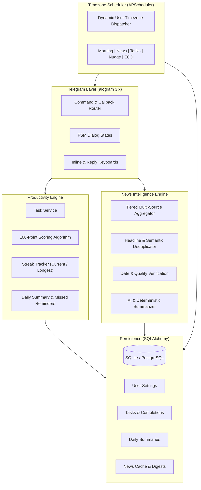

# Telegram Daily Productivity + News Intelligence Bot

A production-ready, timezone-aware **Telegram Daily Productivity & News Intelligence Assistant** built with Python 3.12, aiogram 3.x, SQLAlchemy, and APScheduler.

The bot prioritizes **accuracy, source verification, reliability, timezone correctness (default: Asia/Kolkata), duplicate prevention, and clean Telegram formatting**.

---

## 🌟 Primary Capabilities

### 1. Daily Productivity Engine
* **Predefined Tasks**:
  * 🎥 **Task 1 — A Video** (20 pts): Tracks completed/not completed, video title, duration, link, and remarks.
  * 📚 **Task 2 — Study Hours** (50 pts): Tracks target hours (e.g. 4h), actual hours (e.g. 3h), subject/topic, completion %, and remarks.
  * 🏃 **Task 3 — Exercise** (30 pts): Tracks target minutes (e.g. 45m), actual minutes (e.g. 30m), exercise type, completion %, and remarks.
* **100-Point Configurable Scoring**: Proportional scoring with strict capping (no unlimited points).
* **Streak System**: Tracks current streak, longest streak, total successful days (score >= 70% threshold), missed days, and perfect 100-point days.
* **Interactive UI**: Rich inline keyboards with `[✅ Complete]`, `[⏱ Update]`, `[⏭ Skip]`, `[📊 Progress]`, `[📰 Today's News]`, and `[⚙️ Settings]`.
* **Configurable Reminders**: Morning challenge (08:00), Video (10:00), Study (14:00), Exercise (18:00), Missed task nudges (19:30), and End-of-Day summary check (21:00).

### 2. Daily News Intelligence Digest (25 Items)
Every day delivers 25 fresh, verified stories across 5 categories:
* 🤖 **AI News (5 items)**: GenAI, LLMs, research, chips, robotics, safety, products.
* 🌍 **Geography / World News (5 items)**: Geography, climate/earth events, natural phenomena, international borders, geopolitics.
* 🍥 **Anime News (5 items)**: Official announcements, release dates, seasons, trailers, manga adaptations.
* 🟡 **Telugu News (5 items)**: Andhra Pradesh & Telangana regional developments, Tollywood, local culture.
* 🇮🇳 **India News (5 items)**: National news, science/space (ISRO), economy, policy, infrastructure.

**Source Verification & No-Hallucination Policy**:
* Fresh retrieval from tiered primary & established journalistic sources (PIB, The Hindu, Indian Express, BBC, Anime News Network, Google AI, DeepMind, OpenAI).
* Fuzzy & semantic deduplication collapsing identical stories across outlets.
* Multi-message splitting preventing Telegram message length truncation.
* Multi-language summary support: English (`en`), Telugu (`te`), and bilingual.

---

## 📐 Architecture



---

## 💬 Telegram Commands

| Command | Description |
| :--- | :--- |
| `/start` | Initialize user, load default tasks, and display dashboard |
| `/help` | Display all available commands and help reference |
| `/tasks` | Show today's tasks with interactive inline buttons |
| `/today` | Show today's complete productivity status |
| `/progress` | View today's total score, completion %, and breakdown |
| `/streak` | View current streak, longest streak, and stats |
| `/remarks <text>` | Record reflections / remarks for today |
| `/addtask` | Add a custom productivity task |
| `/removetask` | Remove a task |
| `/complete` | Mark task as completed |
| `/skip` | Mark task as skipped |
| `/news` | Deliver full 25-item daily intelligence digest |
| `/news 5` | Deliver compact top 5 news digest |
| `/ai` | Deliver 5 verified AI developments |
| `/world` | Deliver 5 Geography & World developments |
| `/anime` | Deliver 5 verified Anime announcements |
| `/telugu` | Deliver 5 Andhra Pradesh & Telangana developments |
| `/india` | Deliver 5 Indian national developments |
| `/sources` | Show all news sources and quality tiers |
| `/times` | Show configured reminder times |
| `/settime <type> <HH:MM>` | Configure reminder time (`morning`, `news`, `video`, `study`, `exercise`, `eod`) |
| `/setnewstime <HH:MM>` | Configure news delivery time |
| `/timezone <Zone>` | Change timezone (e.g. `Asia/Kolkata`, `America/New_York`) |
| `/settings` | Open interactive settings panel |
| `/status` | View bot and database status |

### Admin Commands (Restricted to `ADMIN_TELEGRAM_IDS`):
* `/admin` — Open Admin control dashboard
* `/admin_sources` — View active news feeds and status
* `/admin_testnews` — Send immediate test 25-item news digest
* `/admin_testreminder` — Send immediate test task reminder
* `/admin_stats` — View system, user, and database metrics
* `/admin_broadcast` — Broadcast message to all active users
* `/admin_pause` / `/admin_resume` — Pause or resume bot notifications

---

## ⚙️ Configuration (`.env`)

Copy `.env.example` to `.env`:

```bash
cp .env.example .env
```

```dotenv
# Telegram Bot Credentials
TELEGRAM_BOT_TOKEN=123456789:ABCdefGHIjklMNOpqrSTUvwxYZ
TELEGRAM_OWNER_ID=123456789
ADMIN_TELEGRAM_IDS=123456789

# Database
DATABASE_URL=sqlite:///./data/app.db

# Timezone (Default: Asia/Kolkata - IST)
TIMEZONE=Asia/Kolkata

# Scheduled Times (24h format)
MORNING_TIME=08:00
NEWS_TIME=08:30
VIDEO_REMINDER_TIME=10:00
STUDY_REMINDER_TIME=14:00
EXERCISE_REMINDER_TIME=18:00
EOD_TIME=21:00

# Scoring & Features
STREAK_THRESHOLD=70.0
MISSED_REMINDERS_ENABLED=true
BREAKING_NEWS_ENABLED=true

# AI Providers (OpenAI, Groq, Gemini, or Mistral)
OPENAI_API_KEY=
GROQ_API_KEY=
GEMINI_API_KEY=
MISTRAL_API_KEY=
```

---

## 🚀 Deployment & Local Execution

### Local Development

```powershell
# 1. Activate virtual environment
.\.venv\Scripts\Activate.ps1

# 2. Install dependencies
pip install -e ".[test]"

# 3. Run test suite
pytest -v

# 4. Start the application
uvicorn app.main:app --reload
```

Open `http://127.0.0.1:8000/health` to verify service health.

### Docker Deployment

```powershell
# Build and run with Docker Compose
docker compose up -d --build

# View logs
docker compose logs -f
```

---

## 🧪 Testing

The repository contains unit and integration tests covering scoring, streaks, task tracking, news parsing, deduplication, and scheduler logic:

```powershell
pytest
```
